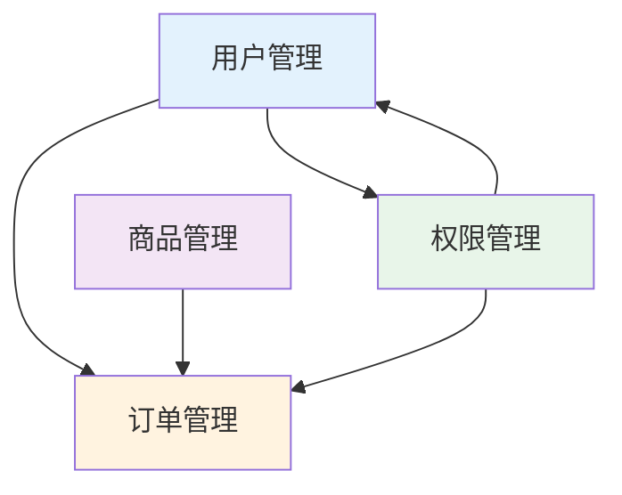
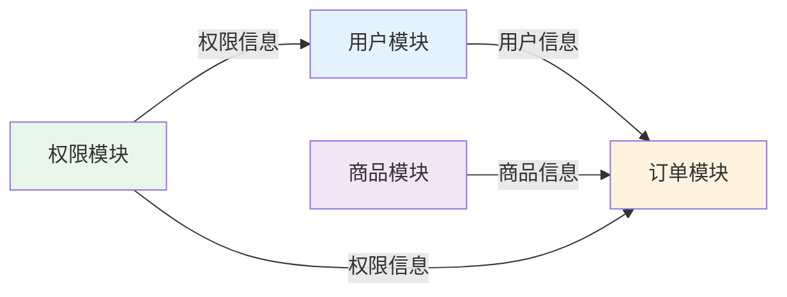

# 模块联动关系说明书

> 本文件定义项目的模块边界、职责划分和联动关系，所有模块开发必须严格遵循本规范。

## 一、模块职责边界表

| 模块名称 | 核心职责 | 唯一数据源 | 禁止职责 | 依赖模块 |
|---------|---------|-----------|---------|---------|
| [示例] 用户管理 | 用户 CRUD、权限分配 | 用户信息（users 表） | 不得维护订单数据 | 权限模块 |
| [示例] 订单管理 | 订单 CRUD、状态流转 | 订单信息（orders 表） | 不得单独维护用户数据 | 用户模块、商品模块 |
| [示例] 权限管理 | 角色权限配置、权限校验 | 权限配置（permissions 表） | 不得直接修改用户状态 | 无 |
| [示例] 商品管理 | 商品 CRUD、库存管理 | 商品信息（products 表） | 不得处理订单逻辑 | 无 |

### 填写说明

- **核心职责**：该模块负责的核心功能，用一句话说明
- **唯一数据源**：该模块独占维护的数据，其他模块只能读取不能修改
- **禁止职责**：明确该模块不应该做什么，避免职责越界
- **依赖模块**：该模块需要读取哪些模块的数据

## 二、模块联动关系图



### 联动关系说明

| 源模块 | 目标模块 | 联动类型 | 触发时机 | 数据传递 |
|--------|---------|---------|---------|---------|
| [示例] 用户管理 | 订单管理 | 状态同步 | 用户禁用时 | 用户 ID、新状态 |
| [示例] 订单管理 | 商品管理 | 库存扣减 | 订单创建时 | 商品 ID、数量 |
| [示例] 权限管理 | 用户管理 | 权限校验 | 用户操作前 | 用户 ID、操作类型 |

## 三、数据流向规则

### 核心原则

1. **单向数据流**：数据只能从上游模块流向下游模块
2. **唯一数据源**：每类数据只有一个模块负责维护
3. **禁止直接耦合**：模块间不得直接调用对方的内部方法

### 数据流向图



### 数据读取规则

| 数据类型 | 唯一来源模块 | 允许读取的模块 | 读取方式 |
|---------|-------------|---------------|---------|
| [示例] 用户信息 | 用户管理 | 订单、权限、商品 | 通过全局状态或 API |
| [示例] 订单信息 | 订单管理 | 用户、商品 | 通过 API 查询 |
| [示例] 权限配置 | 权限管理 | 所有模块 | 通过全局状态 |

## 四、联动触发规则

### 同步联动（实时触发）

| 触发事件 | 源模块 | 目标模块 | 联动动作 | 失败处理 |
|---------|--------|---------|---------|---------|
| [示例] 用户禁用 | 用户管理 | 订单管理 | 关闭该用户未付款订单 | 回滚用户状态 |
| [示例] 订单创建 | 订单管理 | 商品管理 | 扣减商品库存 | 取消订单创建 |
| [示例] 权限变更 | 权限管理 | 用户管理 | 刷新用户权限缓存 | 记录日志，下次登录生效 |

### 异步联动（延迟触发）

| 触发事件 | 源模块 | 目标模块 | 联动动作 | 延迟时间 |
|---------|--------|---------|---------|---------|
| [示例] 订单完成 | 订单管理 | 用户管理 | 更新用户积分 | 5 分钟内 |
| [示例] 商品下架 | 商品管理 | 订单管理 | 通知相关订单 | 10 分钟内 |

## 五、技术实现标准

### 跨模块通信方式

1. **全局状态管理**（推荐）
   - 工具：[填写，如 Vuex / Pinia / Redux / Zustand]
   - 适用场景：频繁读取的共享数据（用户信息、权限配置）
   - 规范：
     - 模块状态命名：`[模块名]/[状态名]`
     - 只能通过 actions/mutations 修改
     - 禁止跨模块直接修改状态

2. **全局事件总线**（推荐）
   - 工具：[填写，如 mitt / EventEmitter / RxJS]
   - 适用场景：跨模块事件通知（状态变更、操作完成）
   - 规范：
     - 事件命名：`[模块名]:[事件名]`（如 `user:disabled`）
     - 事件参数：使用对象传递，包含必要的上下文信息
     - 事件监听：在模块初始化时注册，销毁时移除

3. **API 调用**（备选）
   - 适用场景：跨模块数据查询、低频操作
   - 规范：
     - 统一使用封装的 API 方法
     - 禁止直接访问其他模块的内部 API
     - 必须处理错误和加载状态

### 状态同步机制

```javascript
// 示例：用户禁用时同步订单模块

// 1. 用户模块触发事件
eventBus.emit('user:statusChanged', {
  userId: '123',
  oldStatus: 'active',
  newStatus: 'disabled',
  timestamp: Date.now()
})

// 2. 订单模块监听事件
eventBus.on('user:statusChanged', async (data) => {
  if (data.newStatus === 'disabled') {
    await closeUnpaidOrders(data.userId)
    logger.info('已关闭用户未付款订单', data)
  }
})
```

### 联动校验逻辑

1. **权限校验**：
   - 所有跨模块操作前，必须先通过权限模块校验
   - 校验失败时，禁止执行联动操作

2. **数据一致性校验**：
   - 联动操作前，校验源数据是否存在且有效
   - 联动操作后，校验目标数据是否正确更新

3. **异常处理**：
   - 联动失败时，必须回滚源操作或记录补偿任务
   - 记录详细的错误日志，包含上下文信息

## 六、异常处理规范

### 联动失败策略

| 失败类型 | 处理策略 | 用户提示 | 日志记录 |
|---------|---------|---------|---------|
| [示例] 权限校验失败 | 阻止操作 | "无权限执行此操作" | 记录用户 ID、操作类型 |
| [示例] 目标模块不可用 | 记录补偿任务 | "操作已提交，稍后生效" | 记录任务 ID、重试次数 |
| [示例] 数据不一致 | 回滚源操作 | "操作失败，请重试" | 记录完整上下文 |

### 补偿机制

1. **补偿任务队列**：
   - 联动失败时，将任务加入补偿队列
   - 定时重试（最多 3 次）
   - 重试失败后，转人工处理

2. **回滚机制**：
   - 关键联动操作使用事务
   - 联动失败时，自动回滚源操作
   - 记录回滚日志

## 七、同步机制

### 实时同步

- **适用场景**：关键业务流程（订单创建、支付、库存扣减）
- **实现方式**：同步 API 调用 + 事务
- **超时时间**：5 秒

### 延迟同步

- **适用场景**：非关键业务（积分更新、通知发送）
- **实现方式**：消息队列 + 异步任务
- **延迟时间**：5-10 分钟

### 最终一致性

- **适用场景**：统计数据、报表生成
- **实现方式**：定时任务 + 数据对账
- **同步周期**：每小时/每天

## 八、全局操作日志

### 日志记录规范

所有跨模块联动操作，必须记录全局操作日志：

```javascript
// 日志格式示例
{
  "timestamp": "2026-02-27T10:30:00Z",
  "sourceModule": "user",
  "targetModule": "order",
  "action": "closeUnpaidOrders",
  "trigger": "user:statusChanged",
  "context": {
    "userId": "123",
    "oldStatus": "active",
    "newStatus": "disabled"
  },
  "result": "success",
  "duration": 150,
  "error": null
}
```

### 日志查询

- **存储位置**：[填写，如数据库表 / 日志文件 / 日志服务]
- **查询方式**：[填写，如管理后台 / 日志平台]
- **保留时间**：[填写，如 30 天 / 90 天]

## 九、开发检查清单

### 新增模块时

- [ ] 明确模块的核心职责和唯一数据源
- [ ] 明确模块的禁止职责，避免越界
- [ ] 明确模块依赖的其他模块
- [ ] 更新模块职责边界表
- [ ] 更新模块联动关系图

### 新增联动时

- [ ] 明确联动的触发时机和数据传递
- [ ] 选择合适的联动方式（同步/异步）
- [ ] 实现联动的校验逻辑
- [ ] 实现联动的异常处理和补偿机制
- [ ] 记录全局操作日志
- [ ] 更新联动关系表

### 修改联动时

- [ ] 评估对其他模块的影响
- [ ] 更新联动关系文档
- [ ] 通知相关模块的开发者
- [ ] 补充或修改测试用例

## 十、参考实现

### 标杆模块

| 模块名称 | 文件路径 | 参考要点 |
|---------|---------|---------|
| [示例] 用户管理 | `@/modules/user/` | 标准的模块结构、状态管理、事件触发 |
| [示例] 订单管理 | `@/modules/order/` | 标准的联动监听、异常处理、日志记录 |

### 联动示例

| 联动场景 | 文件路径 | 参考要点 |
|---------|---------|---------|
| [示例] 用户禁用联动订单 | `@/modules/user/linkage/disableUser.js` | 完整的联动流程实现 |
| [示例] 订单创建扣减库存 | `@/modules/order/linkage/createOrder.js` | 事务处理、回滚机制 |

---

## 使用说明

1. **项目初始化时**：先完成本文档，明确所有模块的边界和联动关系
2. **开发新模块前**：先更新本文档，确认模块职责和联动规则
3. **代码审查时**：对照本文档检查是否符合联动规范
4. **联动失败时**：查看全局操作日志，定位问题原因
