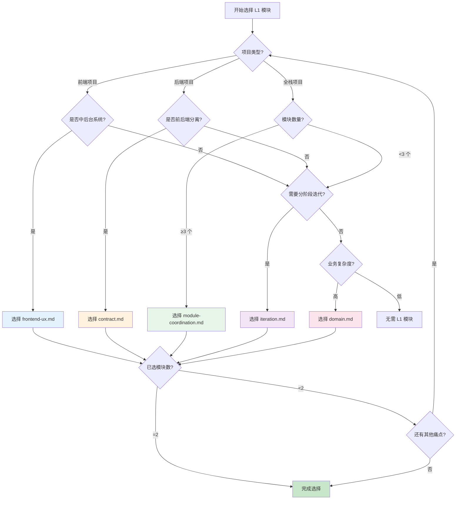

# L1 可选模块指南

**L1 = 按痛点补足 L0 底座的可选功能模块**

L0 底座（discovery + epic + spec + milestones + tasks）解决了"目标乱、AI 跑偏"的核心问题。
当项目有额外痛点时，从 L1 中**按需选 1-2 个模块**补足即可。

## 选择约束（重要）

1. **同类痛点只加一个模块**：例如"分阶段迭代"的痛点，选了 `iteration.md` 就不再加其他迭代规划类模块
2. **总数 ≤ 2 个**：超过 2 个会增加维护成本，违背"简单高效"原则
3. **稳定结论回到权威位置**：行为与契约整合到 `spec.md`；产品事实、Capability、Invariant、Change/Decision 维护在各自治理状态中，L1 模块只是辅助输入

## 模块清单

| 模块文件 | 解决的核心痛点 | 适用场景 | 上手难度 |
|---------|--------------|---------|---------|
| `contract.md` | 前后端解耦 / 接口不统一 | 前后端分离项目、API 服务 | 入门 |
| `iteration.md` | 分阶段迭代混乱 / 长期维护 | 中小型业务产品、需多轮迭代 | 入门 |
| `domain.md` | 复杂业务难以分工 / 代码结构混乱 | 中大型项目、团队协作 | 进阶 |
| `frontend-ux.md` | AI 生成的 UX 不符合预期 / 交互不统一 | 中后台系统、表单密集型前端项目 | 入门 |
| `module-coordination.md` | 多模块联动断裂 / UX 流转不连贯 | ≥3 个模块且存在跨模块联动的项目 | 进阶 |

## 使用方法

1. 在项目 `.rpi-outfile/specs/l1/` 下创建对应模块文件（参考下方模板）
2. 在 `00_master_spec.md` 的 L1 索引处补充模块链接
3. 将关键决策同步回写到 `l0/spec.md` 的相关章节

---

## 模板：`contract.md`（接口契约驱动）

> 适用：前后端分离 / API 项目，需先定接口再分头实现

```markdown
# 接口契约

## 核心业务场景（3-5 个）

| 场景 | 请求方 | 响应方 | 触发条件 |
|------|-------|-------|---------|
| 用户登录 | 前端 | 认证服务 | 用户提交账号密码 |

## 接口规范

### 全局约定
- 前缀：`/api/v1`
- 请求格式：`Content-Type: application/json`
- 响应格式：`{ "code": 0, "data": {}, "msg": "" }`
- 错误码：`0=成功, 400=参数错误, 401=未授权, 500=服务异常`

### 核心接口

#### POST /api/v1/auth/login
请求：`{ "username": "string", "password": "string" }`
响应：`{ "code": 0, "data": { "token": "string", "expires_at": "ISO8601" } }`
错误：`401 密码错误`, `400 参数缺失`

## 整合到 spec.md
> 将上述接口规范复制到 `l0/spec.md` 的"接口契约"章节
```

---

## 模板：`iteration.md`（分阶段迭代规划）

> 适用：需要长期迭代、分阶段交付的业务产品

```markdown
# 迭代规划

## 阶段边界定义

### M0（核心闭环，1-3 个 Must）
**交付物**：可端到端运行的核心链路
**验收**：手动或自动测试可复现
Must:
- [ ] 功能 A（最小可验证）

Won't（本阶段明确不做）:
- [ ] 功能 B
- [ ] 功能 C
- [ ] 功能 D

### M1（功能稳定，补齐边界）
**交付物**：集成环境可复现，契约测试通过
新增 Must（基于 M0 反馈）:
- [ ] 错误处理完善
- [ ] 接口契约固化

### M2（上线准备）
**交付物**：e2e 通过，安全扫描通过，回滚方案文档化
补全项:
- [ ] 部署脚本验证
- [ ] 故障恢复演练

## 整合到 spec.md
> 将 M-1/M0/M1/M2 的验证结论、Must/Won't 与工程证据同步到 `l0/milestones.md` 对应章节
```

---

## 模板：`domain.md`（领域划分）

> 适用：复杂业务逻辑、团队分工协作的中大型项目

```markdown
# 领域划分

## 核心业务领域（2-3 个，粗粒度）

| 领域 | 职责边界 | 核心业务对象 | 负责人/模块 |
|------|---------|------------|------------|
| 用户域 | 账号、认证、权限 | User, Session, Role | auth 模块 |
| 订单域 | 下单、支付、履约 | Order, Payment, Shipment | order 模块 |
| 商品域 | 商品信息、库存 | Product, Inventory | product 模块 |

## 领域间依赖关系

```
用户域 ←── 订单域 ──→ 商品域
```

依赖原则：单向依赖，禁止循环引用

## 核心业务对象定义

### User
- id: string（唯一标识）
- username: string
- roles: Role[]

## 整合到 spec.md
> 将领域划分表和核心对象定义整合到 `l0/spec.md` 的"数据结构"章节
```

---

## 模板：`frontend-ux.md`（前端 UX 规范增强）

> 适用：中后台管理系统、表单密集型项目，解决 AI 生成的 UX 不符合预期问题

```markdown
# 前端 UX 规范

## UI 组件库
- 组件库：Ant Design / Element Plus / Material-UI
- 版本：[填写版本号]

## 产品体验与视觉方向
- 核心用户任务：[填写]
- 视觉气质与 Token：[填写]
- 必须覆盖的加载/空/错/权限/恢复状态：[填写]
- 标杆页面：[填写路径]

## 表格 CRUD 标准实现

### 项目规则
1. 根据任务复杂度、上下文保留和设备约束选择页面、弹窗或抽屉
2. 危险操作必须有确认、撤销或恢复机制
3. 所有核心操作必须定义加载、成功、空状态和错误恢复
4. 复用项目组件与 Token，例外必须记录理由

## 可访问性与性能
- 键盘、焦点、语义、标签与对比度：[填写]
- 数据瀑布、Bundle、重渲染、长列表与图片预算：[填写]

### 禁止行为
❌ 未读取现有设计系统就重建视觉语言
❌ 只实现理想成功路径
❌ 无语义交互、隐藏焦点或仅靠颜色表达状态
❌ 未更新 Change/Spec 就改变流程、权限或业务不变量

## 标杆模块参考
- 模块：用户管理（`@/views/user/index.vue`）
- 参考要点：标准表格 CRUD 实现、弹窗表单、操作反馈

## 整合到 spec.md
> 将 UX 规范整合到 `l0/spec.md` 的"前端规范"章节
```

---

## 模板：`module-coordination.md`（多模块协同规范）

> 适用：≥3 个模块且存在跨模块联动的项目，解决模块联动断裂问题

```markdown
# 多模块协同规范

## 模块职责边界表

| 模块名称 | 核心职责 | 唯一数据源 | 禁止职责 | 依赖模块 |
|---------|---------|-----------|---------|---------|
| 用户管理 | 用户 CRUD、权限分配 | 用户信息（users 表） | 不得维护订单数据 | 权限模块 |
| 订单管理 | 订单 CRUD、状态流转 | 订单信息（orders 表） | 不得单独维护用户数据 | 用户模块、商品模块 |

## 模块联动关系

| 源模块 | 目标模块 | 联动类型 | 触发时机 | 数据传递 |
|--------|---------|---------|---------|---------|
| 用户管理 | 订单管理 | 状态同步 | 用户禁用时 | 用户 ID、新状态 |
| 订单管理 | 商品管理 | 库存扣减 | 订单创建时 | 商品 ID、数量 |

## 技术实现标准
- 状态管理：Vuex / Pinia / Redux / Zustand
- 事件总线：mitt / EventEmitter / RxJS
- 事件命名：`[模块名]:[事件名]`（如 `user:disabled`）

## 标杆模块参考
- 模块：用户管理（`@/modules/user/`）
- 参考要点：标准的状态管理、事件触发、异常处理

## 整合到 spec.md
> 将模块联动关系整合到 `l0/spec.md` 的"模块协同"章节
```

---

## 选择决策树



## 常见组合推荐

| 项目场景 | 推荐组合 | 说明 |
|---------|---------|------|
| 中后台管理系统（单模块） | `frontend-ux.md` | 统一 UX 交互标准 |
| 中后台管理系统（多模块） | `frontend-ux.md` + `module-coordination.md` | UX 规范 + 模块联动 |
| 前后端分离项目 | `contract.md` + `frontend-ux.md` | 接口契约 + UX 规范 |
| 长期迭代的业务产品 | `iteration.md` + `frontend-ux.md` | 分阶段规划 + UX 规范 |
| 复杂业务多模块项目 | `domain.md` + `module-coordination.md` | 领域划分 + 模块联动 |
| API 服务项目 | `contract.md` | 接口契约驱动 |
| 小工具/脚本 | 无需 L1 模块 | L0 底座已足够 |
