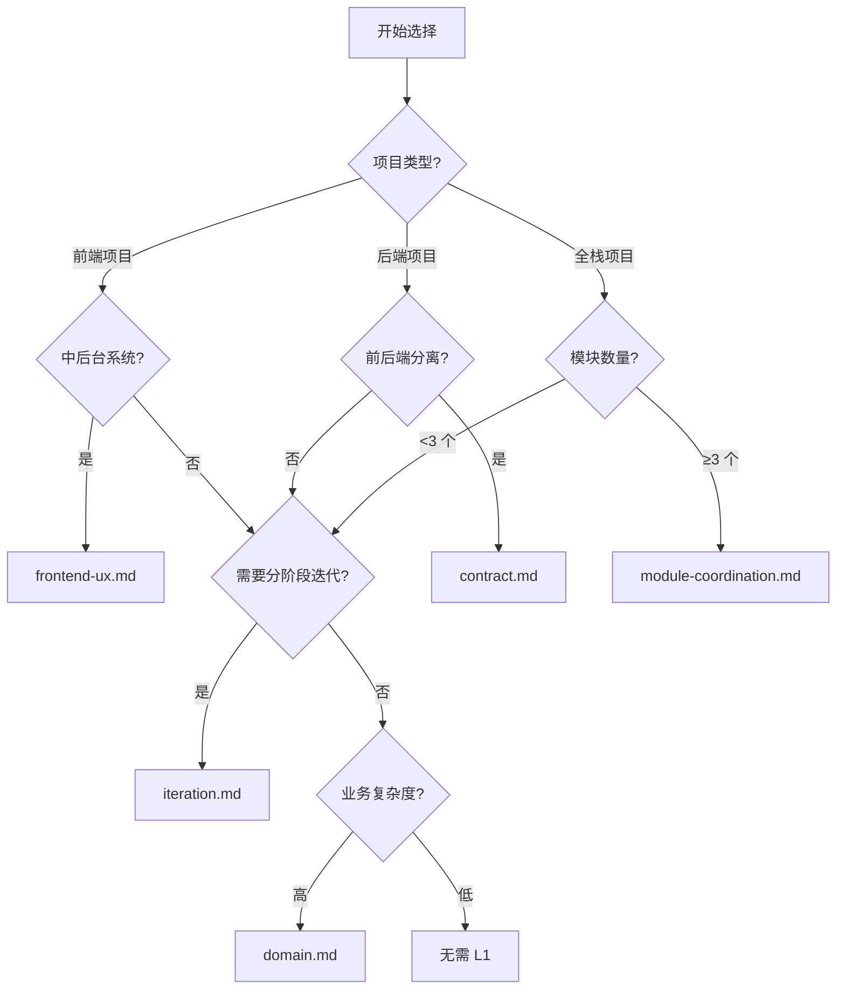
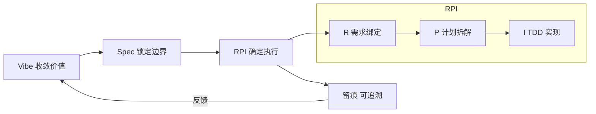
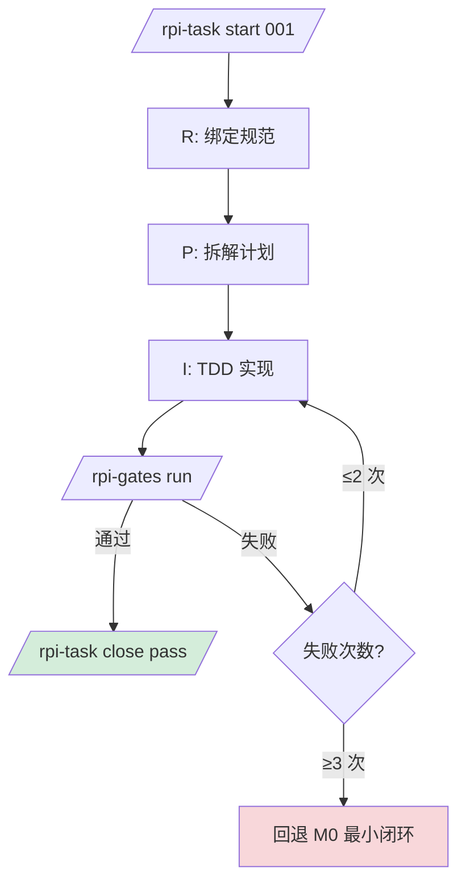
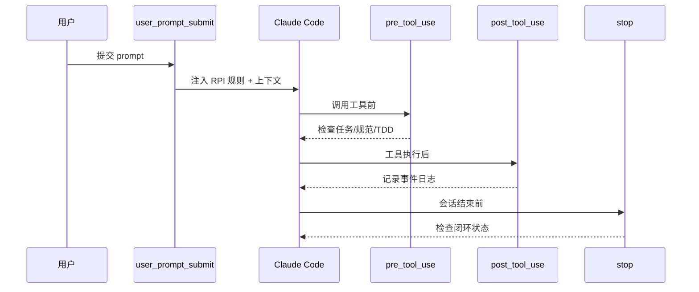
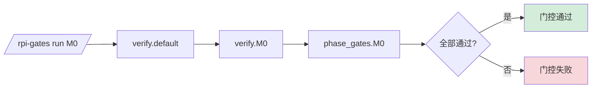

# RPI Workflow

> Vibe-Spec + RPI 双核心驱动的 Claude Code AI 开发工作流框架

[](LICENSE)

## Table of Contents

- [简介](#简介)
- [快速开始](#快速开始)
- [理论介绍](#理论介绍)
- [核心理念](#核心理念)
- [跨工具协同](#跨工具协同)
- [命令速查](#命令速查)
- [全指令手册](#全指令手册)
- [目录结构](#目录结构)
- [配置说明](#配置说明)
- [按项目选配](#按项目选配)
- [工作流程](#工作流程)
- [实际案例](#实际案例)
- [进阶使用](#进阶使用)
- [FAQ](#faq)
- [贡献指南](#贡献指南)
- [许可证](#许可证)

## 简介

RPI Workflow 通过 Hook 机制和规范分层，将 Claude Code 的 AI 辅助编码从"概率正确"收敛为"确定正确"。

**解决什么问题：**

- AI 实现随机性高 → 通过 RPI 三步闭环 + TDD 约束收敛
- 规范与实现漂移 → 通过强制回写 + spec 同步检查
- 上下文噪声 → 通过 Context Pack 分阶段精准注入
- 缺乏执行留痕 → 通过事件日志 + 根因分类实现全链路追溯
- 前端 UX 失控 → 通过 UX 规范模板 + 标杆模块机制（可选）
- 多模块联动断裂 → 通过全局骨架 + 联动完整性检查（可选）
- Hook 热路径开销高 → 通过任务级签名缓存 + 增量校验降低重复检查成本
- 跨模型/跨工具协作偏移 → 通过 `portable contract + task capsule` 固化可执行约束

## 快速开始

### 前置条件

- 已安装 [Claude Code CLI](https://docs.anthropic.com/en/docs/claude-code)
- 已安装 `jq`（必需）

### 安装

```bash
# 复制框架到你的项目
cp -r /path/to/rpi-workflow/.claude ~/my-project/
cp /path/to/rpi-workflow/CLAUDE.md ~/my-project/
```

### 7 步上手

```bash
# 1. 环境检查
/rpi-check env

# 2. 初始化项目（生成业务化 L0 基线 + MVP 骨架）
/rpi-init 我要做一个待办事项管理工具

# 3. 想法深化（生成 4 阶段链路与 A/B/C 业务段差异，回填 discovery 结论）
/rpi-init deepen

# 4. 展开规范（实化 discovery/epic/spec/milestones/tasks）
/rpi-spec expand

# 5. 健康检查
/rpi-check doctor

# 6. 启动任务
/rpi-task start 001

# 7. 完成任务
/rpi-gates run M0
/rpi-task close pass auto 主链路通过
```

> 注意：`.rpi-outfile/` 只会在执行初始化创建步骤后生成（例如 `/rpi-init <idea>` 或 `rpi.sh init setup ...`）。  
> 初始化前请以 `.rpi-blueprint/specs` 作为模板参考；初始化后以 `.rpi-outfile` 作为运行事实源。

> `/rpi-init`、`/rpi-init deepen`、`/rpi-spec expand` 现在共享同一套业务画像推断。  
> 生成的 `discovery.md / epic.md / spec.md / milestones.md / tasks.md` 应该直接体现你的业务领域，不应再回落为“核心记录/一线业务操作人员”之类的通用模板。

> 详细步骤见 [QUICKSTART.md](./QUICKSTART.md)

## 理论介绍

RPI Workflow 的设计目标不是“让 Agent 更自由”，而是“让 Agent 在可证明、可审计、可回放的工程约束中稳定产出”。

**它融合了三层理论：**

1. **Deterministic Engineering（确定性工程）**  
   把需求、边界、验收条件写成结构化规范，先约束后实现，降低模型随机性带来的发散。

2. **Harness Engineering（受控自治工程）**  
   通过风险分级、架构边界、Spec Link、预算上限等“工程护栏”，允许自动化执行，但拒绝不可控执行。

3. **Agentic Execution（有限自治执行）**  
   在明确预算和门控下启用自治能力（如自动重试、自动修复、A2A 评审），把自治限定在可回退范围内。

**六个关键机制：**

- **唯一事实源**：规范与代码关系通过 `spec-state` / `spec-link` 固化，避免长期漂移。
- **反熵机制**：`/rpi-auto entropy` 定期扫描并修正偏移，防止迭代越久越失真。
- **运行时治理**：`runtime.json` + profile 控制严格度，支持 regulated / enterprise / lab 不同模式。
- **审计闭环**：事件日志、门控日志、任务归档、审计包与审计报表形成完整证据链。
- **DDD-Lite 语义层**：统一语言 + 限界上下文 + 业务不变量，作为 AI 执行前的语义与边界护栏。
- **热路径缓存**：precode/spec-link 在任务内按签名缓存，只在规范、规则或配置变化时重校验。
- **可移植契约包**：在 `rpi-outfile` 内输出可移植执行约束，外部模型可按同一 contract 执行。
- **业务化初始化**：`/rpi-init` 与 `/rpi-spec expand` 共用领域画像源，初始化产物与后续规范实化保持一致。

这也是 `/rpi-check theory` 的核心价值：持续校验“理论层约束”是否仍被执行层遵守。

**MVP 范围框选机制：**

- 范围单位是“跨阶段业务链路”，不是零散功能点。
- 每个需求先生成 4 阶段画布（S1→S4）和链路候选池（L1/L2/L3...）。
- A/B/C 表示业务段选择（范围轴），M0~M2 表示阶段扩展（深度轴）：
  - A：选择 S0（MVP 运营段）
  - B：选择 S0 + S1（成长期）
  - C：选择 S0 + S1 + S2（成熟期，S3 进入路线图）
- 覆盖率门槛是对“已选业务段”的质量约束：
  - A：P0 覆盖率 >= 40%，至少 1 条主链路 + 1 条异常链路
  - B：P0 覆盖率 >= 80%，主路径可用且可复测
  - C：P0 覆盖率 = 100%，并补齐治理链路
- M0/M1/M2 阶段扩展策略：
  - M0：交付已选业务段的可运营闭环（不是演示版）
  - M1：成长迭代优化，或新增 1 条受控业务方向
  - M2：成熟期规模化、性能稳定性与治理能力完善（可小范围生态试点）
- 前端“完整可用 UX”仅覆盖已选 Must 链路，不覆盖 Won't 或后续阶段功能。
- 用户可对非核心能力做“提升/降权”调权，但必须显式记录取舍理由与加权覆盖率目标。

**DDD-Lite 融合规则：**

- A：至少覆盖 1 个 Core 上下文（语义先收敛，快速验证）。
- B：覆盖 Core + 1 个 Supporting 上下文（验证跨上下文协作）。
- C：覆盖全部 P0 上下文，并包含治理上下文（审计/合规/追溯）。
- DDD-Lite 只做语义与边界治理，不默认强制上全量 DDD 战术模式。
- 调权策略（可选）：默认最多提升 1 项非核心能力，必须同步降权 1 项并写明理由。

## 核心理念

```
Vibe（收敛价值） → Spec（锁定边界） → RPI（确定执行） → 留痕（可追溯）
```

**Vibe-Spec 阶段配比：**

| 阶段 | Vibe:Spec | 重心 |
|------|-----------|------|
| M0 核心闭环 | 6:4 | 覆盖已选核心业务链路（Must ≤ 3，Won't ≥ 3） |
| M1 成长迭代 | 3:7 | 契约、集成、异常路径与稳定性，允许新增 1 条受控方向 |
| M2 成熟扩展 | 2:8 | 可观测、可回滚、安全审计、规模化与治理完善 |

**RPI 执行模型：**

- **R（Requirement）** — 绑定规范、提取事实、标记未知
- **P（Plan）** — 拆任务、列测试、定义验收
- **I（Implement）** — TDD 实现（Red → Green → Refactor），执行质量门控

## 跨工具协同

框架在关键节点（`spec expand`、`task start/pause/resume/close/abort`）会自动刷新：

- `.rpi-outfile/state/portable/contract.latest.json`
- `.rpi-outfile/state/context/task_capsule.json`
- `.rpi-outfile/state/portable/evidence_template.json`
- `.rpi-outfile/state/portable/evidence.latest.json`
- `.rpi-outfile/state/agent-review/review_card.latest.json`

这些文件属于运行期产物：只有在 `.rpi-outfile` 已创建后才可用。

这三类产物可直接交给其他 AI/编码工具使用：

1. `contract.latest.json`：显式 `OPSX` 契约，固化 Objective / Policy / Spec / Execution。
2. `task_capsule.json`：当前任务最小上下文（范围、动作、失败窗口）。
3. `evidence_template.json`：统一证据结构模板（Red/Green/Refactor/Gate/Review）。
4. `evidence.latest.json`：当前任务最新证据快照。
5. `review_card.latest.json`：标准化评审裁决卡（approved / manual_review_required / rejected）。

同时，`.rpi-outfile/specs/l0/` 下的 `discovery/epic/spec/milestones/tasks` 也设计为可直接外发给其他 AI/编码工具消费：

- `discovery.md`：范围、链路、DDD-Lite 语义边界
- `spec.md`：契约、数据模型、关键流程、非功能预算
- `tasks.md`：把已选 Must 链路拆成可执行任务
- 这些文件应是业务化事实，而不是通用模板占位词

建议对外部工具执行“裁决后置”：

- 外部工具负责实现；
- 最终仍由 `/rpi-check` + `/rpi-gates` + `/rpi-task close` 判定是否通过。

## 命令速查

完整参数说明见 [COMMANDS.md](./COMMANDS.md)。

### 主命令（仅 8 个）

| 主命令 | 作用 | 示例 |
|------|------|------|
| `/rpi-init` | 初始化与范围深化（setup/deepen/bootstrap） | `/rpi-init 我要做一个订单系统` |
| `/rpi-task` | 任务生命周期（start/pause/resume/abort/close/phase/status） | `/rpi-task start 001` |
| `/rpi-check` | 质量与规范检查（env/doctor/precode/full/...） | `/rpi-check full` |
| `/rpi-spec` | Spec 工程（build/verify/sync/link/expand） | `/rpi-spec verify --scope all --quiet` |
| `/rpi-gates` | 门控（preview/setup/run） | `/rpi-gates run M0` |
| `/rpi-mode` | 运行模式（show/harness/profile/on/off） | `/rpi-mode profile balanced-enterprise` |
| `/rpi-observe` | 观测审计（logs/trace/evals/audit-pack/audit-report/recover） | `/rpi-observe logs --task TASK-001` |
| `/rpi-auto` | 自动化（run/review/memory/entropy） | `/rpi-auto entropy --strict` |

### 常用动作速查

| 场景 | 命令 |
|------|------|
| 环境检查 | `/rpi-check env` |
| 健康检查 | `/rpi-check doctor` |
| 质量评分 | `/rpi-check doctor`（输出 artifact quality score：completeness / semantic / traceability） |
| 启动任务 | `/rpi-task start 001` |
| 关闭任务 | `/rpi-task close pass auto <说明>` |
| Discovery/Contract/Scope | `/rpi-check discovery` / `/rpi-check contract` / `/rpi-check scope` |
| 架构与风险 | `/rpi-check architecture` / `/rpi-check risk --tool Bash --value "<cmd>" --json` |
| 全局骨架 | `/rpi-check skeleton-init` / `/rpi-check skeleton` |
| 阶段实化 | `/rpi-spec expand` 或 `/rpi-spec expand "<确认信息>"`（自动实化 `specs/phases/m1.md`、`specs/phases/m2.md`，并补全 verify.M1/M2） |
| 任务切换 | `/rpi-task pause <reason>` / `/rpi-task resume [task_id]` / `/rpi-task abort <reason>` |
| 产物恢复 | `/rpi-observe recover list --target .rpi-outfile/specs/l0/discovery.md` / `/rpi-observe recover restore .rpi-outfile/specs/l0/discovery.md` |

> `architecture.rules.json` 已支持 `import_forbid` 与 `source_allowlist` 规则类型，可用于机械化约束脚本/模块边界。

## 全指令手册

- 完整语法、参数语义、默认值、示例： [COMMANDS.md](./COMMANDS.md)

## 目录结构

```
rpi-workflow/
├── .claude/
│   ├── commands/          # 斜杠命令
│   │                       # 主命令面：init/task/check/spec/gates/mode/observe/auto
│   ├── hooks/             # 生命周期钩子（5 个）
│   ├── rules/             # 开发规则（6 + 3 monorepo）
│   ├── skills/            # 技能定义（7 个）
│   ├── settings.json      # Claude Code 配置
│   └── workflow/
│       ├── config/        # 配置（runtime.json + gates 预设）
│       ├── context/       # 阶段上下文包（5 个 jsonl）
│       ├── engine/        # Python 引擎（spec-state / guardrails / task-flow / project-ops / automation / hooks）
│       ├── injections/    # 阶段注入模板（m0/m1/m2）
│       └── rpi.sh         # 微内核入口
├── .rpi-blueprint/        # 模板库
│   └── specs/
│       ├── 00_master_spec.md
│       ├── l0/            # 核心模板（discovery/spec/tasks/epic 等）
│       ├── l1/            # 可选增强模块（frontend-ux/module-coordination）
│       ├── l2/            # 工程护栏（engineering-guardrails）
│       └── phases/        # 阶段定义（m0/m1/m2）
├── .gitignore
├── CLAUDE.md              # AI 记忆入口
├── QUICKSTART.md          # 快速上手
├── prd.md                 # 产品需求文档
└── README.md              # 本文件
```

> `.rpi-outfile/` 是运行时产物（已在 `.gitignore` 中排除），由使用框架的项目自动生成，不属于框架本身。
> `.rpi-outfile/` 的创建时机为初始化创建步骤之后（通常是 `/rpi-init <idea>` 或 `rpi.sh init setup ...`）。
> 初始化前建议阅读 `.rpi-blueprint/specs`；初始化后建议优先消费 `.rpi-outfile/state/*` 与 `.rpi-outfile/specs/*`。
> 当命令会覆盖关键规范文件时，框架会自动快照到 `.rpi-outfile/state/recovery/snapshots/`，索引在 `.rpi-outfile/state/recovery/index.jsonl`，可通过 `/rpi-observe recover` 查看与恢复。

## 配置说明

### 依赖

| 依赖 | 级别 | 缺失行为 |
|------|------|---------|
| `jq` | 必需 | exit 1 + 平台安装提示 |
| `python3` 或 `python` | 必需 | spec-state 引擎不可用，`/rpi-task start` 等命令会失败 |
| `rg` (ripgrep) | 推荐 | 自动降级为 `grep -E` |

```bash
# 自动检测并提示
/rpi-check env

# 手动安装
sudo apt-get install -y jq python3 ripgrep   # Linux
brew install jq python ripgrep               # macOS
winget install jq Python.Python.3 ripgrep    # Windows
```

### runtime.json

控制框架严格程度，所有开关有安全默认值：

```json
{
  "profile_name": "balanced-enterprise",
  "strict_mode": false,
  "start_require_ready": false,
  "close_require_spec_sync": false,
  "allow_generic_red": true,
  "risk_matrix_enabled": true,
  "risk_profile_override": "",
  "architecture_enforce": false,
  "architecture_require_rules": false,
  "architecture_scan_max_files": 2000,
  "architecture_scan_exclude_dirs": [".git", "node_modules", "dist"],
  "spec_state_required": true,
  "spec_link_enforce": false,
  "precode_guard_mode": "warn",
  "tdd_mode": "recommended",
  "tdd_exempt_path_regex": "(^|/)(infra|ops|scripts|migrations|docker|\\.github)/|(^|/)Dockerfile$|\\.ya?ml$|\\.toml$|\\.ini$",
  "tdd_exempt_command_regex": "(^|[[:space:]])(docker|kubectl|terraform|ansible|helm)([[:space:]]|$)",
  "mvp_coverage_threshold_a": 40,
  "mvp_coverage_threshold_b": 80,
  "mvp_coverage_threshold_c": 100,
  "mvp_low_confidence_ratio_max": 30,
  "ddd_lite_mode": "warn",
  "ddd_min_glossary_terms": 6,
  "ddd_min_bounded_contexts": 2,
  "ddd_min_invariants": 3,
  "mvp_priority_override_mode": "warn",
  "mvp_weighted_coverage_tolerance": 10,
  "mvp_max_promote_non_core": 1,
  "auto_rpi_enabled": false,
  "audit_pack_required_on_close": false,
  "stop_loop_max_blocks": 4,
  "stop_loop_timeout_minutes": 30
}
```

> `mvp_coverage_threshold_*` 用于定义 A/B/C 覆盖等级门槛，`mvp_low_confidence_ratio_max` 用于定义低置信度链路预算。

> `ddd_lite_mode` 控制 DDD-Lite 校验策略：`off|warn|enforce`。`strict-regulated` 建议使用 `enforce`，`balanced-enterprise` 默认 `warn`。

> `mvp_priority_override_mode` 控制“提升/降权”调权策略是否告警或阻断；`mvp_weighted_coverage_tolerance` 控制调权可接受的原始覆盖率差值容差。

> 大仓库建议按需设置 `architecture_scan_max_files` 与 `architecture_scan_exclude_dirs`，降低架构检查的扫描开销。

> 详见 [runtime.example.md](.claude/workflow/config/runtime.example.md)

### Spec Engine

- `spec-state` 由 Python 引擎实现：`.claude/workflow/engine/spec_state_tool.py`
- `pre_tool_use` 完整决策内核由 Python 引擎实现：`.claude/workflow/engine/pre_tool_use_core.py`
- `risk/spec-link/discovery/contract/scope/architecture/linkage/ux-precheck` 由 Python 引擎实现：`.claude/workflow/engine/guardrails_tool.py`
- `profile/start/close/gates-auto` 生命周期流程由 Python 引擎实现：`.claude/workflow/engine/task_flow_tool.py`
- `env/doctor/bootstrap` 项目运维流程由 Python 引擎实现：`.claude/workflow/engine/project_ops_tool.py`
- `init deepen/spec expand`、`check theory|entry|ux|skeleton|skeleton-init|bootstrap`、`mode harness`、`gates preview|setup|run`、`observe logs|trace|evals|audit-pack|audit-report|recover`、`auto run|review|memory|entropy`、`task pause|resume|abort|phase` 等能力由 Python 引擎实现：`.claude/workflow/engine/automation_tool.py`
- Hook 引擎由 `.claude/workflow/engine/*_core.py` 执行：`session_start`/`user_prompt_submit`/`post_tool_use`/`stop_gate`
- 机器事实源：`.rpi-outfile/specs/l0/spec-source.json`
- 字段别名配置：`.claude/workflow/config/spec_aliases.json`（可按团队语言习惯扩展 discovery 字段标签）
- 热路径优化：precode/spec-link 采用任务级签名缓存，仅在规范或配置变化时重校验
- Stop Hook 输出遵循 Claude Code 当前 schema（使用顶层 `decision/reason`，不输出无效的 `hookSpecificOutput.Stop`）
- PostToolUse Hook 已兼容 Claude Code CLI 当前 Bash payload：
  - 优先读取 `exit_code/exitCode/...`
  - 其次读取 `success/status/is_error/...`
  - 再尝试读取 `transcript_path + tool_use_id`
  - 最后回退到 `tool_response.stdout/stderr/interrupted` 推断
- 目标：避免把成功 Bash 误记为 `exit_code=1`，保证 `events.jsonl` 与自治预算统计可信
- 自治预算计数优先读取 `current_task.json` 累计计数，仅在缺失时回退日志扫描，减少热路径 IO
- 选择策略：
  - `spec-source.json` 新于（或等于）`discovery/spec/tasks` 时，优先用 JSON 构建与校验
  - Markdown 更新后自动重新解析并回写 `spec-source.json`

### gates.json

支持三种预设：

| 预设 | 适用场景 | 内容 |
|------|---------|------|
| `gates.minimal.json` | 快速原型 | 3 个基础检查 |
| `gates.frontend.json` | 前端项目 | UX 合规性检查 |
| `gates.multi-module.json` | 多模块项目 | 联动完整性检查 |

```bash
# 零配置快速启用
cp .claude/workflow/config/gates.minimal.json .claude/workflow/config/gates.json
```

> 详见 [gates.example.md](.claude/workflow/config/gates.example.md)

## 按项目选配

框架采用积木模型，按项目属性选配 L1 模块和门控预设。

### L1 模块选择约束

1. 同类痛点只加一个模块
2. 总数 ≤ 2 个
3. 所有模块内容最终整合到 `spec.md`

### 推荐组合

| 项目场景 | L1 模块 | 门控预设 |
|---------|---------|---------|
| 小工具 / 脚本 | 无需 L1 | `gates.minimal.json` |
| API 服务项目 | `contract.md` | `gates.minimal.json` |
| 中后台系统（单模块） | `frontend-ux.md` | `gates.frontend.json` |
| 中后台系统（多模块） | `frontend-ux.md` + `module-coordination.md` | `gates.multi-module.json` |
| 前后端分离项目 | `contract.md` + `frontend-ux.md` | `gates.frontend.json` |
| 复杂业务多模块 | `domain.md` + `module-coordination.md` | `gates.multi-module.json` |

### 选择决策树



> 详见 [L1 模块选择指南](.rpi-blueprint/specs/l1/README.md)

## 工作流程

### 完整流程



### 阶段划分


### 任务生命周期



### Hook 时序



### 初始化产物

初始化相关命令的职责边界：

- `/rpi-init <idea>`
  - 创建 `.rpi-outfile`
  - 生成业务化 MVP skeleton
  - 生成第一版业务化 `discovery.md / epic.md / spec.md / milestones.md / tasks.md`
- `/rpi-init deepen`
  - 输出 A/B/C 业务段差异
  - 推荐 Must/Won't
  - 回填 `discovery.md` 的方向、覆盖率、链路结论
- `/rpi-spec expand`
  - 锁定当前方向
  - 按同一业务画像源重写 L0 规范
  - 生成 `phases/m1.md`、`phases/m2.md`
  - 刷新 portable contract 与 verify 配置

## 实际案例

### 案例 1：CLI 工具

```bash
# 初始化
/rpi-init 我要做一个文件批量重命名 CLI 工具
/rpi-init deepen  # 选择方向 A，确认链路 IDs（Must/Won't）与覆盖率
/rpi-spec expand  # 实化 L0 规范与 phases

# M0：链路覆盖 — 主链路 + 异常链路（权限/冲突）
/rpi-task start 001
# R: 绑定 spec（输入模式、输出格式、错误处理）
# P: 拆解 — 参数解析 → 规则引擎 → 文件操作
# I: TDD — 先写 rename("foo_bar", "camelCase") 失败测试
/rpi-gates run M0
/rpi-task close pass auto 核心重命名链路通过

# M1：补齐异常路径
/rpi-task phase M1
/rpi-task start 002  # 文件不存在、权限不足、名称冲突
/rpi-gates run M1
/rpi-task close pass auto 异常路径覆盖完成
```

### 案例 2：API 服务

```bash
# 初始化（推荐 L1: contract.md）
/rpi-init 我要做一个用户认证 API 服务
/rpi-init deepen  # 选择方向，确认链路 IDs（L1/L2/L3）与覆盖率
/rpi-spec expand

# M0：链路覆盖 — 注册登录主链路 + Token 异常链路
/rpi-task start 001
# R: 绑定 spec（接口契约、错误码、Token 格式）
# P: 拆解 — 注册接口 → 登录接口 → JWT 签发
# I: TDD — 先写 POST /register 返回 201 的失败测试
/rpi-gates run M0
/rpi-task close pass auto 认证核心链路通过

# M1：契约测试 + 异常路径
/rpi-task phase M1
/rpi-task start 002  # 重复注册、密码强度、Token 过期
/rpi-check contract
/rpi-gates run M1
/rpi-task close pass auto 契约与异常路径完成
```

### 案例 3：多模块中后台系统

```bash
# 初始化（推荐 L1: frontend-ux + module-coordination）
/rpi-init 我要做一个电商管理系统
/rpi-init deepen  # 选择方向，确认链路 IDs（Must/Won't）与覆盖率
/rpi-spec expand

# 全局骨架阶段
/rpi-check skeleton-init
# 定义模块：用户管理、订单管理、商品管理、权限管理
/rpi-check skeleton

# M0：标杆模块（用户管理）
/rpi-task start 001
/rpi-check ux
/rpi-gates run M0
/rpi-task close pass auto 标杆模块完成

# 按依赖顺序开发其他模块（单活跃任务）
/rpi-task start 002  # 权限管理
/rpi-gates run M0
/rpi-task close pass auto 权限模块主链路完成
/rpi-task start 003  # 商品管理
/rpi-gates run M0
/rpi-task close pass auto 商品模块主链路完成
/rpi-task start 004  # 订单管理
/rpi-gates run M0
/rpi-task close pass auto 订单模块主链路完成

# 联动完整性验证
/rpi-check linkage
```

## 进阶使用

### Context Pack 精准注入

框架通过 `.claude/workflow/context/*.jsonl` 按阶段注入上下文，避免全量读仓库：

| 上下文包 | 注入时机 | 内容 |
|---------|---------|------|
| `implement.jsonl` | 实现阶段 | master_spec + discovery + spec + tasks |
| `check.jsonl` | 检查阶段 | 门控配置 + 验收标准 |
| `debug.jsonl` | 调试阶段 | 事件日志 + 门控结果 |
| `ux.jsonl` | 前端任务 | ux-spec + reference-module + ux-flow |
| `linkage.jsonl` | 多模块任务 | module-linkage + ux-flow + reference-module |

### Verify 预检查层

门控执行分两层：`verify`（规范完整性）→ `phase_gates`（阶段质量）。



### 根因追溯

任务关闭时强制分类根因，确保可追溯：

| 分类 | 含义 |
|------|------|
| `spec_missing` | 规范遗漏或不明确导致失败 |
| `execution_deviation` | 规范明确但执行偏差导致失败 |
| `both` | 两者同时存在 |
| `unknown` | 证据不足 |

## FAQ

<details>
<summary>Q: /rpi-check doctor 返回 BLOCKED？</summary>

按提示补齐缺失项，通常是 discovery/spec/tasks 未完成。

</details>

<details>
<summary>Q: Hook 阻止我编辑代码？</summary>

确保已执行 `/rpi-task start`，并且先运行失败测试（TDD Red 证据）。

</details>

<details>
<summary>Q: /rpi-init 或 /rpi-spec expand 生成的内容为什么看起来像通用模板？</summary>

当前实现会在 `init → deepen → spec expand` 三个阶段共享同一套业务画像推断。  
如果你仍看到“核心记录/一线业务操作人员”等泛化词，通常说明原始 idea 过于抽象，缺少行业对象、用户角色、核心动作、明确不做项。  
优先把一句话需求补成“角色 + 业务对象 + 核心动作 + 不做项”的形式后重跑初始化。

</details>

<details>
<summary>Q: events.jsonl 里为什么会把成功 Bash 记成 exit_code=1？</summary>

当前框架已兼容 Claude Code CLI 本地 Bash Hook payload 的多种形态。  
如果你仍看到误判，先执行 `/rpi-check doctor`，再确认 `.claude/settings.json` 中 `PostToolUse` 指向 `bash .claude/workflow/rpi.sh hook-post-tool-use`。  
真实兼容链路位于 [post_tool_use_core.py](/www/wwwroot/1/1.1/RPI/rpi-workflow/.claude/workflow/engine/post_tool_use_core.py)。

</details>

<details>
<summary>Q: 没有测试怎么办？</summary>

建议把 `tdd_mode` 设为 `recommended`（仅告警）而不是关闭。  
基础设施/脚本类改动可通过 `tdd_exempt_path_regex`、`tdd_exempt_command_regex` 配置豁免范围。

</details>

<details>
<summary>Q: 如何中止错误启动的任务？</summary>

使用 `/rpi-task abort <reason>` 优雅退出。

</details>

<details>
<summary>Q: 依赖 jq 和 rg 吗？</summary>

`jq` 是必需依赖，缺失时框架会报错并给出安装命令。`rg`（ripgrep）推荐安装，缺失时自动降级为 `grep -E`。

</details>

<details>
<summary>Q: UX 检查和联动检查是必须的吗？</summary>

不是。UX 规范和多模块协同都是可选的 L1 增强模块，相关配置默认关闭。按需在 `runtime.json` 中启用。

</details>

<details>
<summary>Q: strict-regulated 下 /rpi-task start 被拦截是 bug 吗？</summary>

不是。`strict-regulated` 会强制启用 DDD-Lite 与 precode 校验，若 discovery 不满足最小条目（统一语言/上下文/不变量等）会阻断启动。  
先补齐 `discovery.md` 再执行 `/rpi-task start`。

</details>

<details>
<summary>Q: 英文团队能直接用吗？</summary>

可以。`spec-state` 支持通过 `.claude/workflow/config/spec_aliases.json` 配置字段别名。  
你可以把 `目标/目标用户/选择方向` 等映射为 `Goal/Target User/Direction`，无需改引擎代码。

</details>

<details>
<summary>Q: 出现 Stop hook JSON validation failed 怎么办？</summary>

先执行 `/rpi-check doctor` 检查 Hook 与配置是否同步，再确认 `.claude/settings.json` 中 Stop Hook 指向 `bash .claude/workflow/rpi.sh hook-stop`。  
当前框架要求 Stop Hook 只输出顶层 `decision/reason`（不包含 `hookSpecificOutput.Stop`）；实现位于 `.claude/workflow/engine/stop_gate_core.py`。

</details>

## 贡献指南

1. Fork 本仓库
2. 创建特性分支：`git checkout -b feature/my-feature`
3. 提交变更：`git commit -m 'Add my feature'`
4. 推送分支：`git push origin feature/my-feature`
5. 提交 Pull Request

请确保：

- 新增命令需同步更新命令速查表
- 新增配置项需在 `runtime.example.md` 中补充说明
- Shell 脚本需通过 `shellcheck` 检查

## 许可证

本项目采用 [MIT License](LICENSE) 开源。
